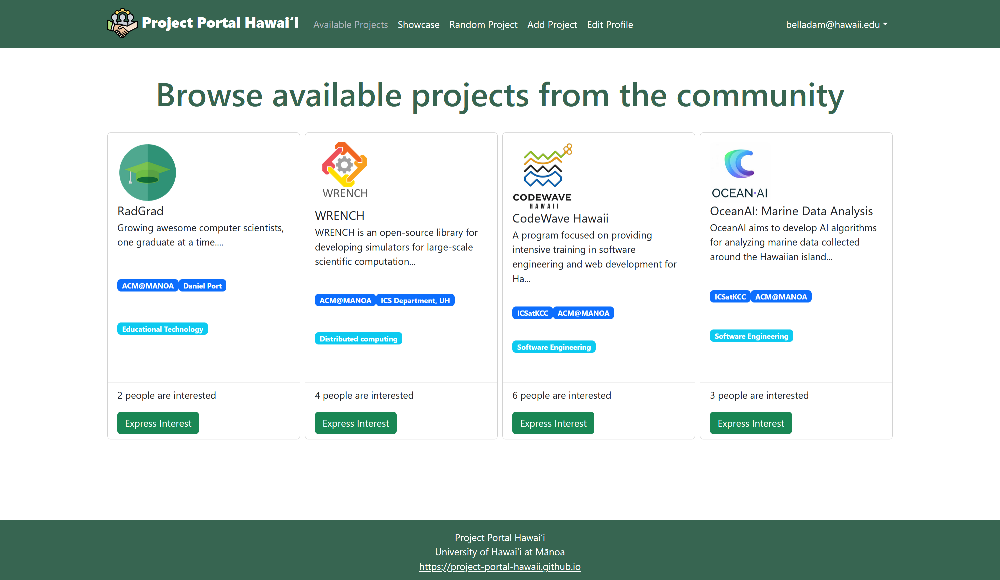
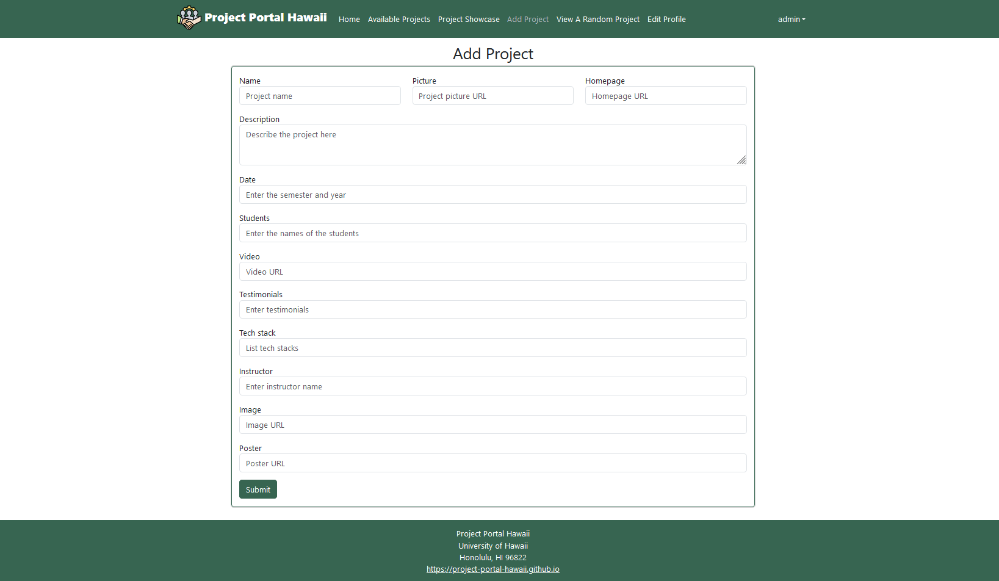

This project involved our team designing and programming a portal for software projects. There are multiple functionalities that we have designed into this project. 
1) A place for intakes for software project proposals. 
2) A database to view and show interest in approved project proposals.
3) A showcase for completed software projects (such as Capstone projects).

For more information about the project see our organization GitHub Page: <a href="https://project-portal-hawaii.github.io/"><i class="large github icon "></i>Project Portal Hawaii</a>

A big portion of my role in this project revolved around designing the Project Collection which is the basis for the database. I modified the template provided by Bowfolios to include all the data fields we were required and designed the Add Project Form which interfaces with this collection in both the Add Project and Edit Project page. See the form below: 

Project Portal Hawaii: <a href="https://project-portal.live/">https://project-portal.live/</a>

